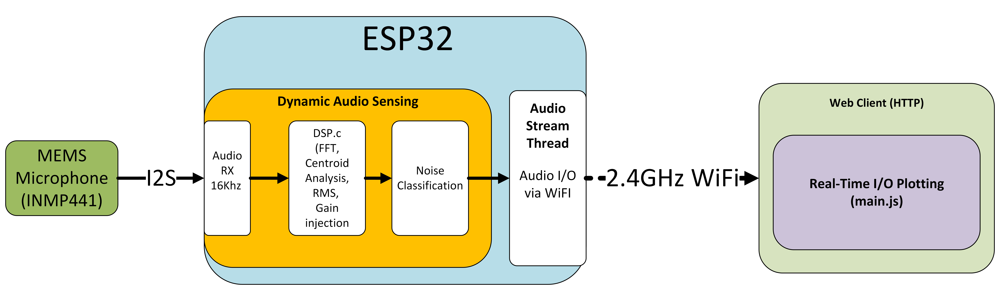
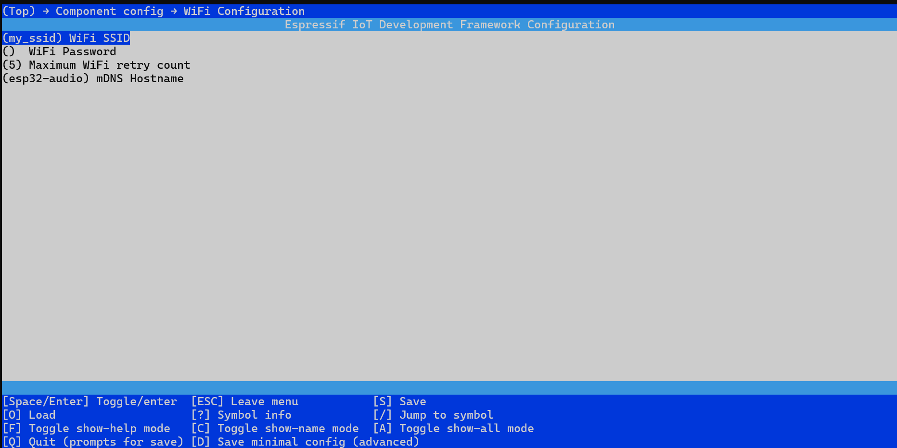
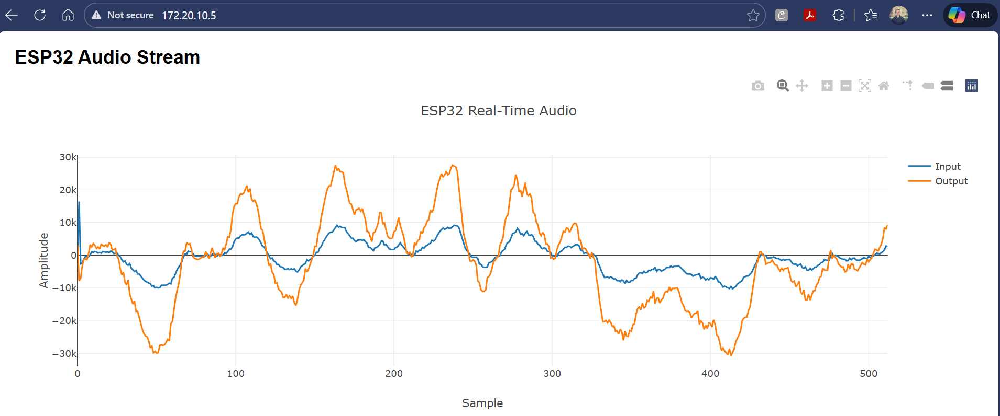

# Dynamic Audio Sensing with Scene Classification on ESP32
## Overview
> This project implements a real-time audio sensing and classification system on the ESP32 platform. It captures ambient audio using a digital MEMS microphone, performs low-power signal analysis (RMS, spectral centroid) and classifies acoustic scenes into categories such as `quiet`, `speech`, `background noise`. 




## Goals
* Capture ambient audio using a digital I2S microphone
* Perform real-time DSP feature extraction on-device
* Classify acoustic scenes (quiet / speech / noise) deterministically
* Apply dynamic gain control based on acoustic context
* Stream raw and processed audio data to a web client in real time

## Hardware Requirements
1. ESP32 DevKit (e.g., ESP32-WROOM-32)
2. INMP441 Digital MEMS microphone (I2S interface)

## Development Environment
* ESP-IDF v5.5.1

* ESP-DSP v1.3.2 (installed via idf.py add-dependency)

* Toolchain: xtensa-esp32-elf (v14.2.0 or later)

* Platform: Windows

## File Structure
```
dynamic_audio_sensing/
├── main/
│   └── main.c                 # System orchestration and task startup
│
├── components/
│   ├── mic_input/
│   │   ├── mic_input.c/h      # I2S microphone interface
│   │
│   ├── dsp/
│   │   ├── dsp_features.c/h   # RMS, spectral centroid, gain logic
│   │
│   ├── audio_pipeline/
│   │   ├── audio_frame.h      # Shared audio frame definition
│   │   ├── sample_process.c   # Mic → DSP → queue
│   │
│   ├── web/
│   │   ├── web_server.c/h     # HTTP + WebSocket server (control plane)
│   │   ├── web_client.c/h     # Audio streaming task (data plane)
│   │   ├── websocket_adapter.c/h  # Transport abstraction
│   │   ├── websocket.c        # Third-party websocket implementation
│   │   ├── websocket_server.c/h
│   │
│   ├── wifi_manager/
│   │   ├── wifi_manager.c/h   # WiFi STA initialization
│
└── CMakeLists.txt

```

## Features & Functionality

The system is split into three independent execution domains:

1. DSP pipeline (real-time, high priority)
2. Transport pipeline (best-effort, non-real-time)
3. Control plane (HTTP/WebSocket lifecycle)

These domains communicate only via FreeRTOS queues, never via shared globals.

```
INMP441 Mic
   ↓
I2S + DMA
   ↓
sample_process_task
   ├─ RMS energy
   ├─ Spectral centroid
   ├─ Scene classification
   └─ audio_frame_t*
          ↓
     audio_frame_queue
          ↓
     web_client_task
          ↓
   WebSocket binary stream
          ↓
   Browser visualization
```
### Signal Acquisition
* Uses I2S interface to receive 24-bit audio samples from the INMP441 microphone
* Samples at 16 kHz with 512-sample buffers (~32 ms window)

### Feature Extraction
* RMS Energy: Measures average signal power
* Spectral Centroid: Calculates center of spectral mass using real FFT
* Implemented using the ESP-DSP library for performance

### Scene Classification
* quiet: Low RMS energy
* speech: Mid-level energy and centroid between 300–3500 Hz
* background noise: High energy or wideband centroid
Real-Time Gain Adjustment

### Real-Time Gain Adjustment
* Applies digital gain scaling to mic input before further use or transmission

#### Gain levels:
* Quiet: +3.0x

* Speech: 1.0x

* Noise: 0.5x

## Usage
1. Clone the repository:
```bash
git clone https://github.com/DmitriLyalikov/dynamic_audio_sensing.git
cd dynamic_audio_sensing
```
2. Set up the ESP-IDF environment:
```bash
idf.py add-dependency espressif/esp-dsp
```

3. Configure WiFi credentials:
```bash
idf.py menuconfig
```



4. Build and flash the firmware:
```bash
idf.py build flash monitor
```

6. Access the web interface:
* Open browser at logged ESP32 IP address with client on same network
* VIew waveform, features and classification.




